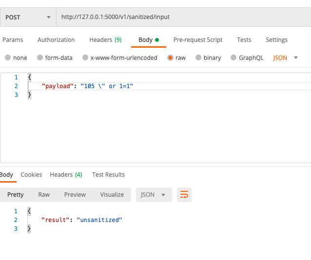
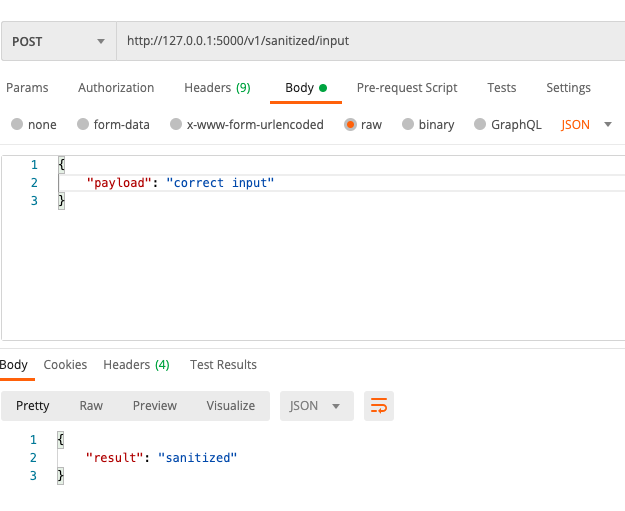

# iCompaas assignment

## General info

This API allows you to check if the payload input may cause SQL injection.


## Table of contents
* [Screenshots](#screenshots)
* [Setup](#setup)
* [Usage](#usage)
* [Owner](#owner)
* [License](#license)

## Screenshoots




## Setup
### Clone the source:

```shell
$ git clone https://github.com/milenakowalska/icompaas_assignment
$ cd icompaas_assignment
```
### Install packages

```shell
$ pip3 install -r requirements.txt
```
### Run and open the app

Run the code in terminal:

```shell
$ export FLASK_APP=run.py
```
```shell
$ flask run
```

According to the displayed information: "Running on http://127.0.0.1:5000/",  \
open the app in browser using the link http://127.0.0.1:5000/

## Usage

First you need to send a POST request in a JSON format. \
The JSON input should take one argument in the following format: 
```shell
{
“payload”: “input"
}
```
The programm will check the input and return "sanitized" if it is safe and will not cause any SQL injection \
or "unsanitized" if it contains any characters that could be used to do SQL injection. 


## Owner
Created by milenakowalska.

## License
[](http://badges.mit-license.org)

- **[MIT license](http://opensource.org/licenses/mit-license.php)**
